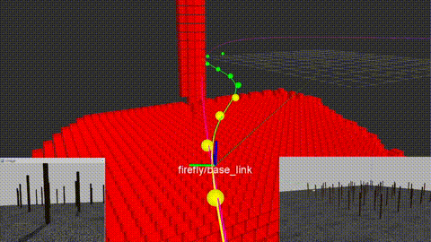

# Ewok: Real-Time Trajectory Replanning for MAVs using Uniform B-splines and 3D Circular Buffer

For more information see
[https://vision.in.tum.de/research/robotvision/replanning](https://vision.in.tum.de/research/robotvision/replanning)

[](https://www.youtube.com/watch?v=jh6tMHjxHSY)

### 1. Related Papers
If you use this code, please cite the respective publications:
* **Real-Time Trajectory Replanning for MAVs using Uniform B-splines and 3D Circular Buffer**, V. Usenko, L. von Stumberg, A. Pangercic, D. Cremers, In 2017 International Conference on Intelligent Robots and Systems (IROS) [[DOI:10.1109/IROS.2017.8202160]](https://doi.org/10.1109/IROS.2017.8202160) [[arXiv:1703.01416]](https://arxiv.org/abs/1703.01416).

### 2 Installation

The system has been tested with Ubuntu 16.04 (ROS Kinetic).

Follow the tutorials to [install ROS Kinetic](http://wiki.ros.org/ROS/Installation) and to [set up catkin workspace](http://wiki.ros.org/ROS/Tutorials/InstallingandConfiguringROSEnvironment).

Install additional dependencies:
```
sudo apt-get install libeigen3-dev libsuitesparse-dev protobuf-compiler libnlopt-dev ros-kinetic-octomap ros-kinetic-octomap-rviz-plugins ros-kinetic-octomap-ros ros-kinetic-sophus libatlas-base-dev python-matplotlib python-numpy
```

Navigate to the source folder of your catkin workspace, download and build the software:
```
cd ~/catkin_ws/src
git clone -b ubuntu_16_04_kinetic https://github.com/VladyslavUsenko/ewok.git
cd ewok
git submodule init
git submodule update

cd ../../
catkin_make
```
Some of the provided examples (trajectory_replanning_big_forest.launch) depend on the forest_gen dataset. With the above commands it should already be downloaded as a git submodule. Please check https://github.com/ethz-asl/forest_gen for more information about the dataset.

### 3. Simulation example
In separate terminal windows:

Start roscore:
```
roscore
```

Start visualization:
```
roscd ewok_simulation/rviz/
rviz -d simulation.rviz
```
Launch the system and simulator:
```
roslaunch ewok_simulation trajectory_replanning_simulation.launch
```

Now you should be able to see Rviz visualization of the system running in simulator. Due to performance reasons GUI of the Gazebo simulator is disabled by default.
To enable it, change the following parameter in `ewok_simulation/launch/trajectory_replanning_simulation.launch`:
```
<arg name="gui" default="true"/>
```

### 4. Circular Buffer vs Octomap benchmarking
In separate terminal windows:

Start roscore:
```
roscore
```
or, if you already have it running, make sure you are not using simulated time:
```
rosparam set use_sim_time false
```

Start visualization:
```
roscd ewok_ring_buffer/rviz/
rviz -d ring_buffer.rviz
```
Run benchmarking script. It will download the dataset, run the computations and show the plots with insertion times:
```
roscd ewok_ring_buffer/benchmarking/
./benchmark.py
```

### 5. B-spline optimization example
In separate terminal windows:

Start roscore:
```
roscore
```
or, if you already have it running, make sure you are not using simulated time:
```
rosparam set use_sim_time false
```

Start visualization:
```
roscd ewok_optimization/rviz/
rviz -d optimization_example.rviz
```
Run optimization example:
```
rosrun ewok_optimization spline_optimization_example3
```


### 6. License
Ewok was developed at the Technical University of Munich. 
The open-source version is licensed under the GNU Lesser General Public License Version 3 (LGPLv3).

